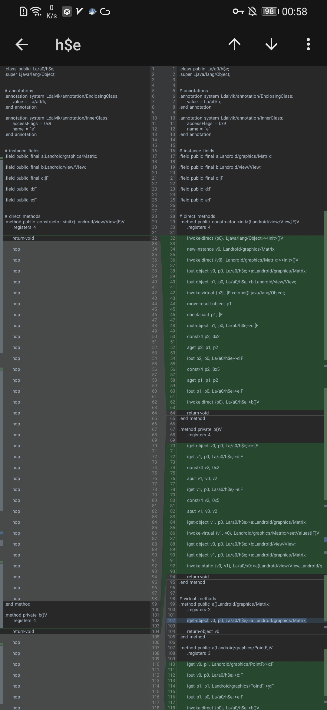

# BlackDex

**[English Version](README_EN.md)**


BlackDex是一个运行在Android手机上的脱壳工具，支持5.0～12，无需依赖任何环境任何手机都可以使用，包括模拟器。只需几秒，即可对已安装包括未安装的APK进行脱壳。

## 项目声明
### 本项目并不针对任何加固，在遇到检测环境等均不处理，仅供安全领域分析用途。项目免费开源仅供学习用途、请勿用于非法用途。否则后果自负！
### Black系列交流群：390562046（QQ）

## 编译说明
运行前请请Make Project一次

运行前请请Make Project一次

运行前请请Make Project一次

## 脱壳说明
本项目针对一（落地加载）、二（内存加载）、三（指令抽取）代壳，摆脱对以往脱壳环境的困扰，几乎支持5.0以上的任何系统。并且拥有 **快速**、**方便**、**成功率高** 的优点。一般只需要几秒钟即可完成对已安装包括未安装应用脱壳。**未安装应用**脱壳时间主要花费在复制文件IO消耗上，由应用大小决定速度。已安装应用一般在数秒内即可完成脱壳。

### 脱壳文件说明
- hook_xxxx.dex **hook系统api脱壳的dex，深度脱壳不修复**
- cookie_xxxx.dex **利用dexFile cookie脱壳的dex，深度脱壳时会修复此dex**


## 脱壳原理
通过DexFile cookie进行脱壳，理论兼容art开始的所有版本。可能少数因设备而异，绝大部分是支持的。资源有限无法大量测试，遇到问题请提issues.

## 深度脱壳
深度脱壳模式下会自主修复被抽取的方法指令，将指向其他内存块的指令回填至DEX内，解决nop问题，但是不会确保一定会有用，例如：指令需要主动调用才解密等则无法回填或者说是无效回填。深度脱壳并不包含任何解密、主动调用等操作。本功能仍然在测试阶段，**可能会出现以下情况，请悉知，愿世上再无nop。**
1. 脱壳时间会大幅度上升，预计几分钟都十几分钟不等
2. 脱壳期间有可能会出现应用闪退（遇到反检测等）
3. 会增加脱壳失败几率
4. 不一定能够100%还原

#### 部分抽取壳脱壳前后对比


## 环境要求
- 一台普通手机
- ~~Xposed~~
- ~~Frida~~
- ~~Magisk~~
- ~~Root~~
- ~~定制系统~~

## 架构特别说明
本项目区分32位与64位，目前是2个不同的app，如在Demo已安装列表内无法找到需要开启的app说明不支持，请使用另一个版本。

BlackDex下载：https://github.com/CodingGay/BlackDex/releases

## 演示


## 感谢
- [VirtualApp](https://github.com/asLody/VirtualApp)
- [VirtualAPK](https://github.com/didi/VirtualAPK)
- [FreeReflection](https://github.com/tiann/FreeReflection)
- [Dreamland](https://github.com/canyie/Dreamland)
- [lkchandexfile](https://github.com/lkchan724/lkchandexfile)
- [xhook](https://github.com/iqiyi/xHook)
- [Dobby](https://github.com/jmpews/Dobby)
### License

> ```
> Copyright 2021 Milk
>
> Licensed under the Apache License, Version 2.0 (the "License");
> you may not use this file except in compliance with the License.
> You may obtain a copy of the License at
>
>    http://www.apache.org/licenses/LICENSE-2.0
>
> Unless required by applicable law or agreed to in writing, software
> distributed under the License is distributed on an "AS IS" BASIS,
> WITHOUT WARRANTIES OR CONDITIONS OF ANY KIND, either express or implied.
> See the License for the specific language governing permissions and
> limitations under the License.
> ```
